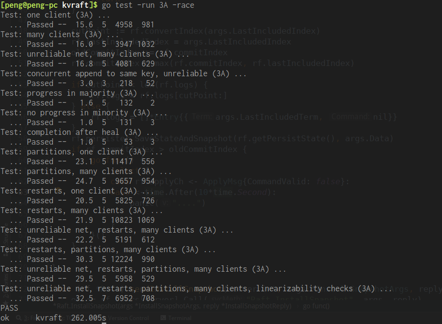

本文是6.824 lab3的实验笔记。

# Lab 3: Fault-tolerant Key/Value Service

> https://pdos.csail.mit.edu/6.824/labs/lab-kvraft.html

## 简介

Lab3需要使用Lab2中实现的Raft模块来完成一个分布式可容错的Key/Value服务。需要提供三种操作：Put(key, value)，Append(key, arg) 和 Get(key)。为实现客户端重复请求检测，一个客户端在同一时间只会有一个未完成（正在进行）的操作。

Lab3A需要实现不使用日志压缩的Key/Value服务。

Lab3B则需要在前面的基础上增加状态快照和日志压缩功能。

## 实现

### Lab3A

**基于Raft实现的KV服务流程：**

1. Raft层完成Leader选举，提供可用的服务。
2. 客户端将操作指令发送到Leader服务器对应的KV服务
3. Leader服务器的KV服务需要先Hold本次请求，然后将指令转发给Raft模组
4. 等待Raft模组达成一致并后，应用该指令到状态机
5. 将结果返回给客户端

**Lab2中提供的Raft接口**

需要用到两个部分

- Start( command ) 

  对传入的命令开始一次共识，如果不是leader返回否。该方法不阻塞，无论是否是leader是否开始尝试达成共识都立即返回。

- applyCh

  当一条日志记录committed之后，会被传入该chan，KV服务从该chan获取已经达成共识的命令并执行。

---

#### 重复检测和获取执行结果

由于Raft层提供的Start()方法仅能表明Raft服务开始尝试达成共识，它不能返回执行结果也不能确保一条命令被成功写入日志。所以本lab的实现关键在于：对于需要执行的命令，如何确认其执行状况以及执行结果。

由于此处还有重复检测的需求，所以可以通过用ClientId_Sequence唯一地确认一条指令，所以只需要将该信息包含在写入日志的指令中，并在Raft层将达成共识的指令通过applyCh传入的时候通过ClientId_Sequence确认并将对应执行结果返回给之前的调用即可即可。

> 重复检测在：http://nil.csail.mit.edu/6.824/2018/notes/l-spinnaker.txt**#duplicate RPC detection**有提到。为避免因网络问题而重发的操作重复执行，客户端需要保证每次只有一个未完成操作，它使用一个递增的序列号来标识每一次操作。将重复操作写入日志是可以的，但是不能将其重复应用到状态机。而每个客户端有一个唯一的Id，所以服务器可以通过客户端Id和序列号来识别过期的操作，从而避免因为网络不可靠重复发送请求导致的重复执行。Get操作是幂等的，可以不需要进行重复检测也不用写入日志，但是需要一次广播来确认自己仍是合法leader才能保证结果有效。在本lab中为方便实现可用与PutAppend相同的方式处理。

以Get为例

```go

func (kv *KVServer) Get(args *GetArgs, reply *GetReply) {
	// Your code here.
	op := Op{
		Cid: args.Cid,
		Op:  "Get",
		Seq: args.Seq,
		Key: args.Key,
	}
	_, _, ok := kv.execute(op)
	if !ok {
		reply.Err = ErrWrongLeader
		return
	}

	result, err := kv.getResult(op)
	if err != nil {
		reply.Err = "OperationError"
		return
	}
	reply.Err = ""
	reply.Value = result.Value
	return
}
```

将客户端操作的客户端Id和序列号写入到日志项中，然后等待执行结果。

#### duplicate table

为了进行检测重复请求，需要在服务端维护一个duplicate table，它为每个客户端保存最新的操作序列号。在执行操作前进行比较，如果某个客户端操作的序列号小于或者等于该客户端最大已知序列号，那么说明这个操作已经在状态机上执行过了，需要忽略。

我使用的duplicate table结构如下：

```go
type DupTable struct {
	mu    sync.RWMutex
	cond  *sync.Cond
	table map[int64]*Result
}
```

其中，保存数据用的map，键为客户端Id（64位随机数）。值为Result结构体，包含序列号信息和该序列号对应操作的执行结果（但是实际上duplicateTable只需要保存客户端id和其最新序列号的映射关系即可）。

每次从applyCh中读取到操作时，应当先使用duplicate table进行检测，如果该操作的序列号更新则执行操作并更新duplicate table中的序列号。

上述Get方法中调用的kv.getResult(op)方法是通过DupTable结构体中的cond来等待duplicate table更新。如果在duplicate table更新时确认了该命令已经达成共识并执行则可以返回执行结果。

#### 客户端实现

客户端需要为自己生成一个随机id，以及为每次请求附带一个递增的序列号。

此外，只有一点需要特别注意：

**在调用服务端RPC执行Get/Put等操作时，无论返回结果是"不是leader"还是操作超时，都应该更换目标服务器进行重试。因为即便服务器仍然认为自己是leader，但写入日志超时表明此时可能由于网络分区等原因它已经不再是合法leader了，所以客户端需要更换请求的目标服务器进行重试。**

### Lab3B

Lab3B需要修改Raft实现，添加一个InstallSnapshot RPC。此外，由于需要对日志进行压缩（丢弃旧日志，使用状态机快照代替其内容），所以如果之前使用了slice来保存日志的话，需要修改相关操作，在日志索引和实际slice索引之间加上偏移量。可使用lastIncludedIndex记录快照中包含的最后一条日志的索引，这样在slice中的日志项的真实索引加上lastIncludedIndex作为偏移量就是其日志索引。

#### 大致流程

- **日志压缩**

  在KVserver发现自身的日志尺寸过大时（可在每次apply时检查持久化数据大小）。应当将自身状态机进行快照，然后通知Raft层本快照包含的内容（lastIncludedIndex），Raft丢弃掉该状态机中已经执行过的日志项（即lastIncludedIndex）并将快照内容和其他Raft数据一并持久化。此处需要持久化的Raft数据除了之前的3项之外还应该包括lastIncludedIndex和lastIncludedTerm。然后Raft将该索引位置之前的所有日志丢弃，然后持久化当前状态。这一操作在任意服务器（Leader/Follower）上都可以独立执行。由于应用到状态机的日志项一定是已提交的，所以这一操作不会破坏一致性。

- 安装快照

  Leader服务器在向Follower发送AppendEntriesRPC（心跳或追加新日志项），如果发现对于该Follower，其nextIndex[i]回溯到了lastIncludedIndex及其之前的位置，那么说明该Follower缺失的日志项过多，应当停止本次AppendEntriesRPC而改为向其发送InstallSnapshotRPC。

#### 快照实现

在每次apply日志项的时候，检查日志持久化大小是否达到限制，如果达到限制则将快照数据发送给raft层，通知raft进行快照。index为本次apply的日志索引，需要确保该索引确实是快照包含的最后一条记录。

```go
func (kv *KVServer) DoLogCompaction(index int) {
	// no compaction
	if kv.maxraftstate < 1 {
		return
	}
	if kv.persister.RaftStateSize() > kv.maxraftstate/2 {
		go kv.rf.Snapshot(index, kv.snapshotBytes())
	}
}
```

需要注意的部分是对applyCh的读取过程不能阻塞。

#### 应用快照

在收到InstallSnapshotRPC时，可能需要将其包含的快照应用到状态机。可以通过立即向applyCh发送一条通知消息来通知KV服务应用快照。

KV服务器在收到该消息时使用快照替换掉自身的状态机，同时，Raft应当将commitIndex，lastIncludedIndex，lastApplied等设置为相应的值。


#### 修改Raft实现

**日志操作相关**

加上偏移量

```go
func (rf *Raft) logLength() int {
	return len(rf.logs) + rf.lastIncludedIndex
}
func (rf *Raft) getLogEntry(index int) *Entry {
	if rf.logLength() <= index || rf.lastIncludedIndex>index {
		return nil
	}
	entry := rf.logs[rf.convertIndex(index)]
	return entry
}
......
```

**InstallSnapshotRPC**


在论文中有对InstallSnapshotRPC的详细描述。

按照其描述实现InstallSnapshotRPC即可。

此外，需要修改Leader向Follower发送AppendEntries的实现，在检测到nextIndex[i]越过了lastIncludedIndex时，需要停止发送AppendEntriesRPC而改为发送InstallSnapshotRPC。


### 总结

相比Lab2的，Lab3在内容上要略少一些，但是实现的自由度要高一些，有些部分需要自行设计而不像Lab2中可以直接参考论文描述。

PartA的关键在于如何在调用raft.Start(command)之后能够获取到对应的执行结果并返回给客户端。

PartB的关键则是需要修改日志相关操作，协调好保存快照/安装快照操作在并发时可能出现的问题——处理不当会导致死锁，已执行的的操作丢失等不能接受的情况。




---

